<p align="center">
  
</p>

<h1 align="center">Rockxy</h1>

<p align="center">
  <a href="README.md">English</a> |
  <a href="README.vi.md">Tiếng Việt</a> |
  <a href="README.zh.md">中文</a> |
  <a href="README.zh-TW.md">繁體中文</a> |
  <a href="README.es.md">Español</a> |
  <a href="README.pt-BR.md">Português do Brasil</a> |
  <a href="README.ja.md">日本語</a> |
  <a href="README.ko.md">한국어</a> |
  <a href="README.fr.md">Français</a> |
  <a href="README.de.md">Deutsch</a> |
  <a href="README.it.md">Italiano</a> |
  <a href="README.tr.md">Türkçe</a> |
  <a href="README.pl.md">Polski</a> |
  <a href="README.nl.md">Nederlands</a> |
  <a href="README.ru.md">Русский</a> |
  <a href="README.uk.md">Українська</a> |
  <a href="README.ar.md">العربية</a> |
  <a href="README.fa.md">فارسی</a> |
  <a href="README.bn.md">বাংলা</a> |
  <a href="README.ro.md">Română</a> |
  <a href="README.ka.md">ქართული</a>
</p>

<p align="center">
  <strong>Прокси-сервер отладки с открытым исходным кодом для macOS.</strong>
</p>

<p align="center">
  Перехватывайте, проверяйте и изменяйте трафик HTTP/HTTPS/WebSocket/GraphQL с помощью собственного приложения Swift, которое вы можете проверять, создавать и доверять.<br>
  Создан для рабочих процессов отладки API, мобильных устройств, MCP, искусственного интеллекта и блокчейна по мере развития Rockxy.<br>
  Локальная (local-first), AGPL-3.0 альтернатива <a href="#rockxy-против-альтернатив">Proxyman и Charles Proxy</a>.
</p>

<p align="center">
  <a href="https://github.com/RockxyApp/Rockxy/releases"></a>
  
  
  <a href="LICENSE"></a>
  <a href="CONTRIBUTING.md"></a>
  <a href="https://github.com/sponsors/LocNguyenHuu"></a>
  <a href="https://opencollective.com/rockxy/donate"></a>
</p>

<p align="center">
  <a href="https://youtu.be/RvkQuwUjBaQ" title="Watch the Rockxy demo on YouTube">
    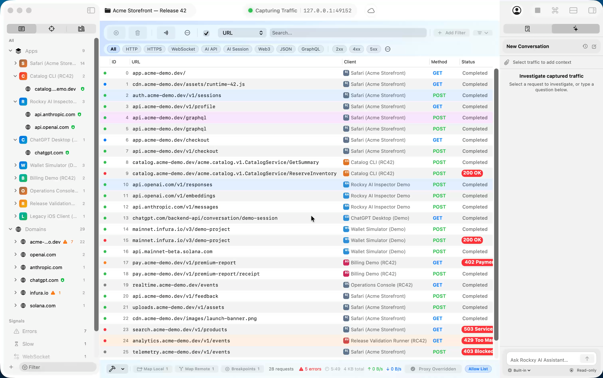
  </a>
</p>

---

<!-- BEGIN GENERATED: latest-release -->
## Latest Tagged Release

**v0.34.0** — 2026-08-07

### Added

- Ask Rockxy Assistant how to use Rockxy or check the current workspace even when no request is selected.
- Open the relevant Rockxy window directly from supported Assistant answers, while keeping every workflow under your control.

### Changed

- Assistant conversations now present clearer summaries, next steps, evidence, and follow-up actions in a more focused native layout.
- Workspace questions report current request, error, and saved-item counts without attaching captured request content.

See [CHANGELOG.md](CHANGELOG.md) for the full release history.
<!-- END GENERATED: latest-release -->

## Основные моменты текущего филиала

- AI Assistant теперь исследует один или несколько выбранных request с помощью встроенного локального анализа или опциональной настроенной модели Ollama/provider, с явным подтверждением Review Data, ограниченным redaction, потоковыми ответами, evidence reveal и инициируемыми пользователем handoff.
- Нативная боковая панель теперь включает переиспользуемые Focus Sets для scope app/domain/path, а также Noise Control уровня workspace, скрывающий совпадающие domain или path без остановки capture.
- Основной workspace теперь использует нативные вертикальные и горизонтальные split view для Context Dock и нижнего inspector, сохраняя разделители полной высоты, согласованные separator toolbar/footer и автоматическое изменение раскладки.
- Upstream Proxy теперь включает бесплатную/основную автоматическую настройку прокси-сервера с маршрутизацией URL-адресов PAC для `DIRECT`, HTTP и HTTPS маршруты, сохраняя при этом существующие границы SOCKS5 и политики аутентификации.
- Рабочие процессы экспорта теперь охватывают OpenAPI YAML/HTML и публикацию Gist с выбранным трафиком, а также сбор полезных данных с учетом редактирования.
- Инструменты инспектора теперь включают фильтрацию JSONPath/ключ/значение и быстрый предварительный просмотр выбранного текста полезной нагрузки, например JWT.
- Инспекция трафика AI и Web3 теперь добавляет метки протокола, вкладки inspector и сводки отладки для распознанных вызовов моделей, трафика JSON-RPC и подсказок оплаты в стиле x402.
- Программа установки разработчика Node.js теперь отражает выбранный клиент во время проверки и содержит более полное руководство по использованию локального хоста.
- Центр настройки разработчиков теперь охватывает среды выполнения, браузеры, клиенты, устройства, платформы и среды с фрагментами для конкретных целей, наблюдателями проверок и честным руководством.
- Инспекция бинарных frame WebSocket теперь включает ограниченные Protobuf wire-format heuristic по запросу, не добавляя decoder work в capture hot path.
- Публичная roadmap теперь сосредоточена на более глубоких protocol-aware rules, replay, comparison и безопасном обмене отредактированными доказательствами.

## Особенности

Инструменты, к которым вы обращаетесь, когда браузерных DevTools недостаточно. Отладка основного трафика для Mac и iOS — встроенная функция для macOS, с общедоступными выпусками и рабочим процессом, ориентированным на локальный уровень.

### Захват трафика

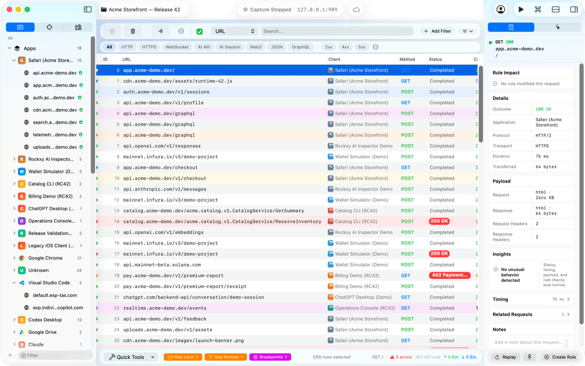

Проверяйте трафик HTTP, HTTPS, WebSocket и GraphQL из любого приложения Mac, интерфейса командной строки или устройства iOS. Инструменты разработчика для браузера заканчиваются в браузере — Rockxy видит остальную часть вашего стека.

`HTTP / HTTPS` · `WebSocket` · `GraphQL` · `iOS Device & Simulator` · `Filter by Process ID` · `Timing Waterfall`

### Расширенный фильтр и поиск

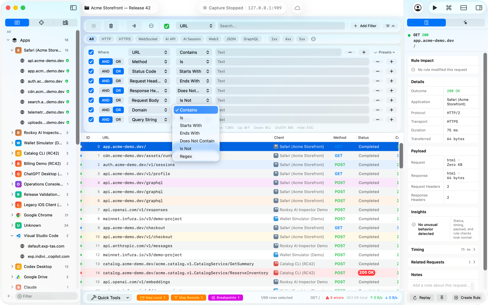

Сократите тысячи перехваченных запросов за считанные секунды. Объедините фильтры метода, хоста, статуса, заголовка, тела и процесса — или запустите полнотекстовый поиск по всему сеансу.

`Multi-Field Filters` · `Full-Text Search` · `Status / Method` · `Header / Body Match` · `Process / Host` · `Saved Filters`

### Focus Sets и Noise Control

Превратите повторяющиеся расследования в переиспользуемые scope боковой панели. Focus Sets объединяет include по app, domain и path с exclude по domain/path, сохраняется между запусками и доступен в каждом workspace. Noise Control продолжает захватывать телеметрию и малоценный трафик, но скрывает их в текущем workspace.

`Reusable Focus Sets` · `App / Domain / Path Scope` · `Include & Exclude` · `Workspace Noise Control` · `Capture Continues`

### AI Assistant

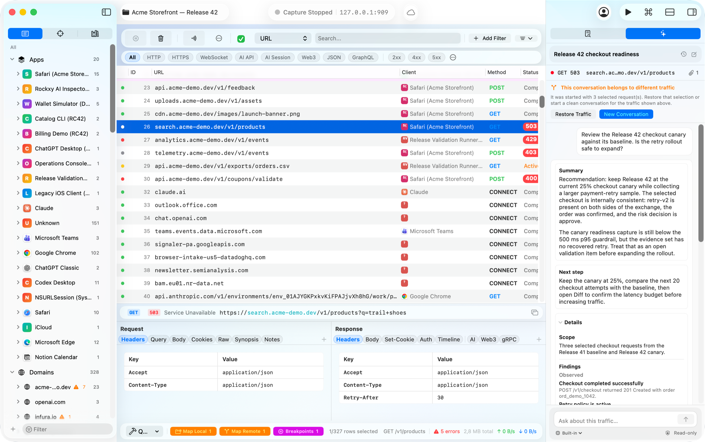

Выберите один или несколько захваченных request и спросите, что произошло, что сломалось, что изменилось или что проверить дальше. Rockxy начинает с анализа на основе доказательств на этом Mac; настроенная модель Ollama или provider запускается только после того, как Review Data покажет точный, ограниченный и отредактированный контекст. Ответы могут раскрыть source request и подготовить нативные follow-up workflow, но никогда автоматически не изменяют трафик и не выполняют действия.

`Built-in Local Analysis` · `Multi-Request Context` · `Ollama & Provider Models` · `Review Data` · `Sensitive-Data Redaction` · `Read-only Actions`

[Прочитать руководство AI Assistant](docs/features/ai-assistant.mdx).

### MCP-сервер для внешних AI-клиентов

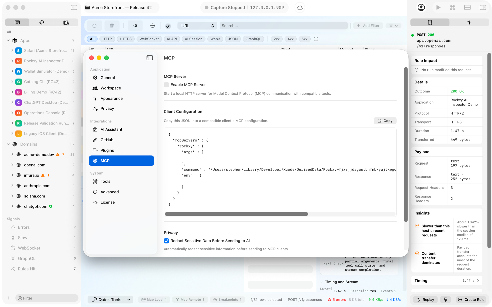

Позвольте Claude Desktop или Cursor проверять захваченный трафик с помощью десяти инструментов только для чтения в локальном MCP-сервере Rockxy. Спросите «почему это 500?» вместо вставки заголовков в чат. Реализация с открытым исходным кодом, аутентифицируется по токену и по умолчанию сохраняет redaction конфиденциальных данных включённым.

`Claude Desktop` · `Cursor` · `Local stdio` · `Redaction` · `Open Source`

### Центр настройки для разработчиков

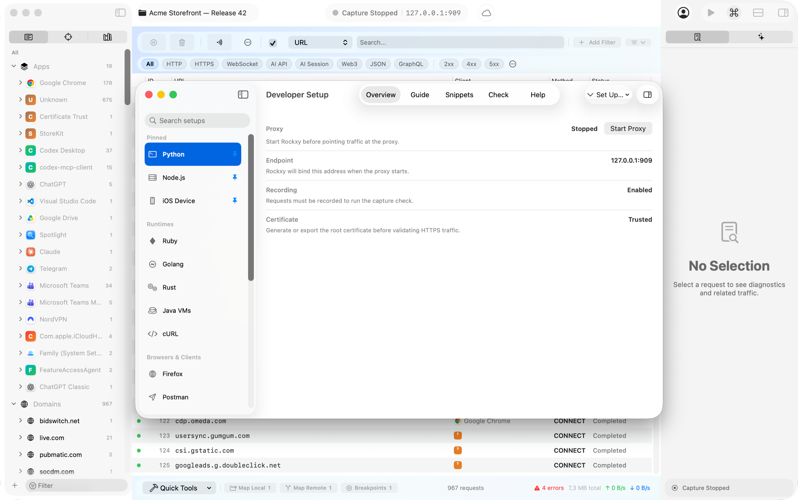

Скопируйте и вставьте фрагменты прокси-сервера для Python, Node.js, Go, Rust, cURL, Docker и браузеров, затем нажмите «Выполнить тест», чтобы убедиться, что трафик действительно проходит.

`Python` · `Node.js` · `Go / Rust / Java` · `cURL / Docker` · `One-Click Verify` · `Trust Diagnostics`

### Управление сертификатами для отладки HTTPS

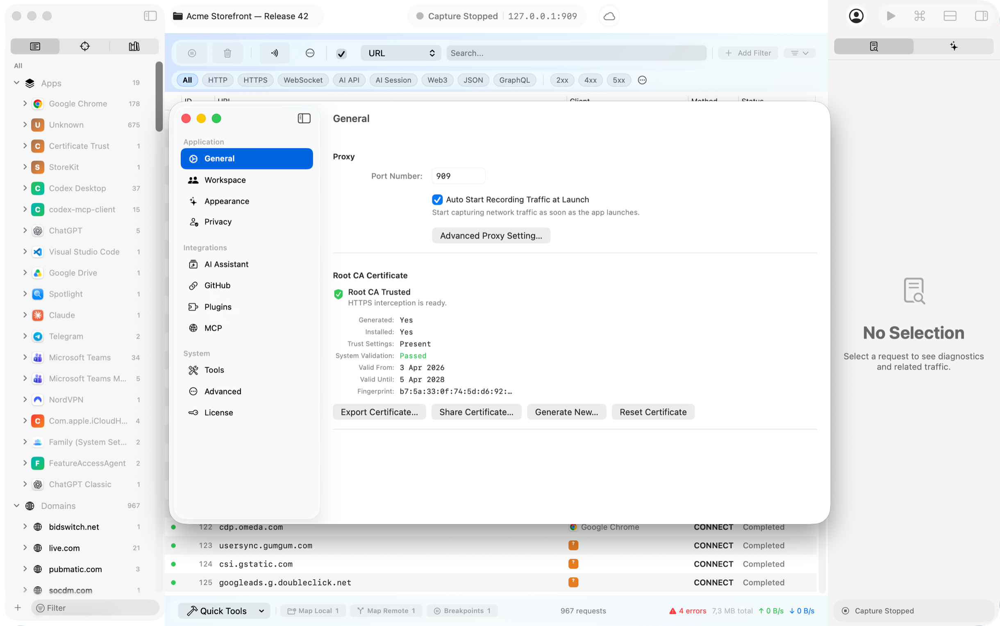

Корневой центр сертификации ECDSA P-256, созданный при первом запуске и запечатанный в вашей связке ключей. Расшифровать HTTPS с первой попытки; закрепленные хосты проходят автоматически.

`P-256 ECDSA Root CA` · `Keychain-Sealed Key` · `Per-Host Leaf Certs` · `Trust Wizard` · `Pinned-Host Passthrough` · `Rotate / Reset`

### SSL-прокси и расшифровка HTTPS

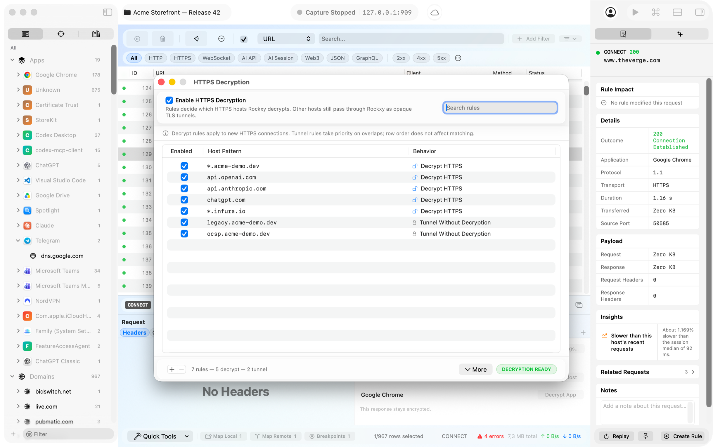

Выберите, какие хосты получат расшифровку TLS. Расшифрованный трафик показывает реальные заголовки и JSON; все остальное проходит в зашифрованном виде. Правила с подстановочными знаками позволяют масштабировать домены одним щелчком мыши.

`Per-Host Decryption` · `Wildcard Rules` · `Allow / Deny List` · `TLS 1.2 / 1.3` · `Pinned Host Passthrough`

### Обход прокси

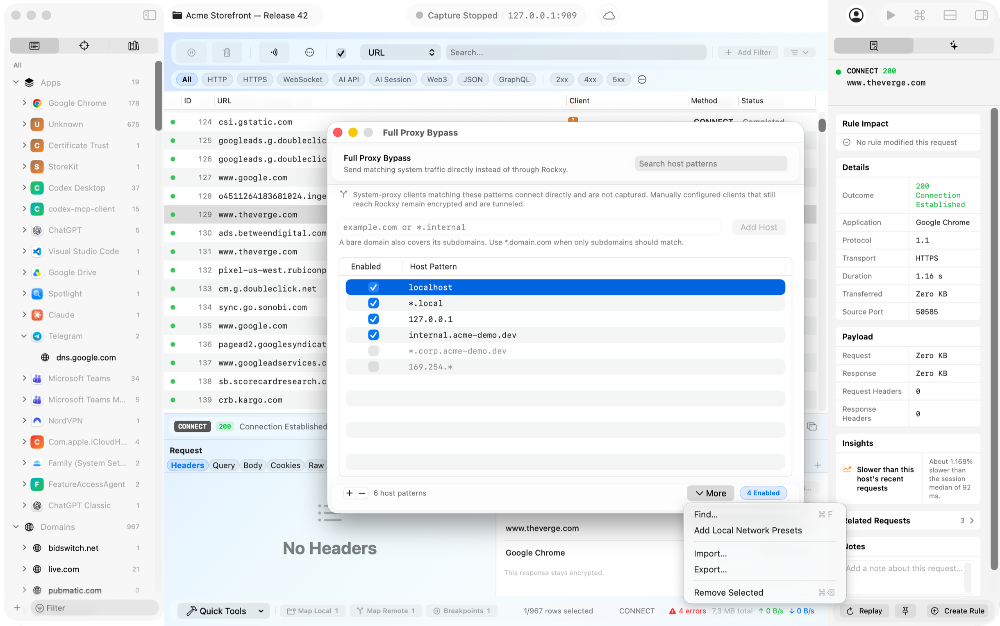

Пропускайте определенные хосты, чтобы приложения, внутренние службы или данные телеметрии, закрепленные сертификатами, никогда не попадали в захват. Подстановочные знаки делают список коротким, и ваш журнал запросов фокусируется на том, что вас действительно волнует.

`Per-Host Bypass` · `Wildcard Patterns` · `Skip Pinned Hosts` · `Mute Telemetry` · `Reduce Noise` · `Toggle Anytime`

### Черный список

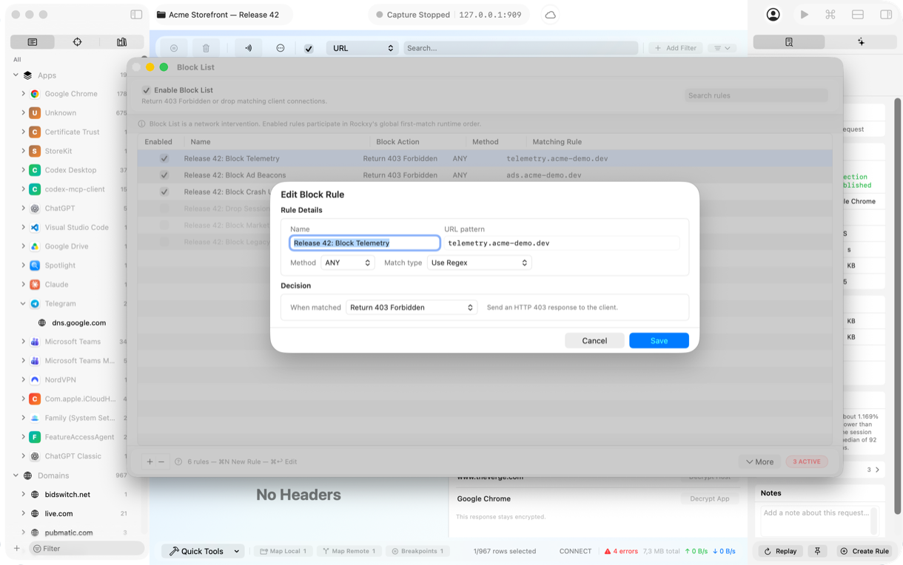

Заставьте любой хост выйти из строя. Откажитесь от рекламных сетей, сторонних трекеров или нестабильных зависимостей, чтобы увидеть, как ухудшается качество вашего приложения, когда оно исчезнет, ​​не меняя ни строчки кода.

`Per-Host Block` · `Wildcard Match` · `Simulate Outage` · `Test Fallbacks` · `Strip Trackers` · `Toggle Anytime`

### Карта Местная

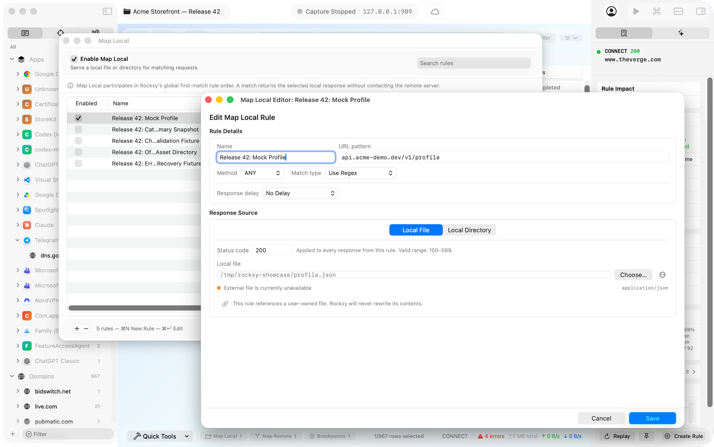

Предоставляйте сохраненный файл или дерево каталогов вместо живого ответа. Замените полезные данные JSON, воспроизведите снимок или прикрепите нестабильный сторонний API к локальной копии во время отладки.

`File or Directory` · `Response Snapshot` · `Regex Patterns`

### Карта удаленного доступа

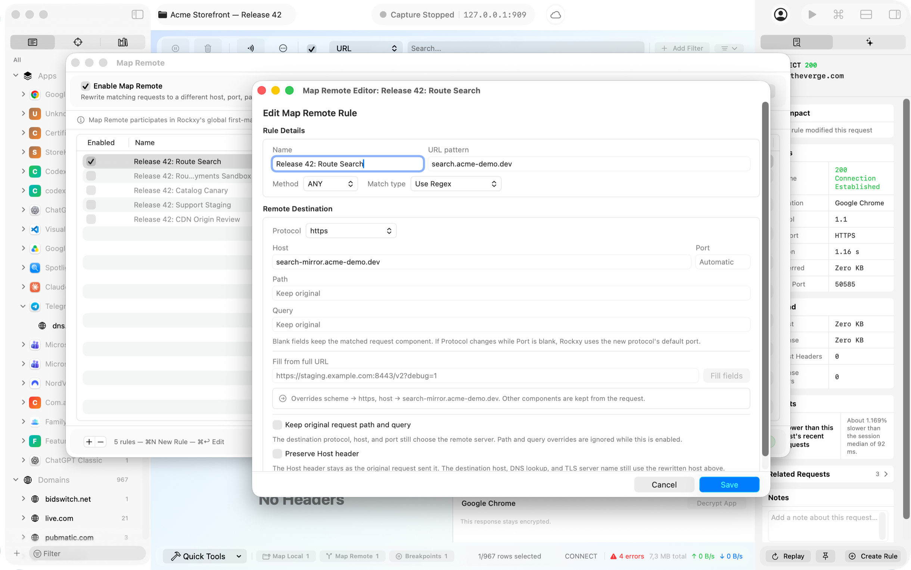

Перепишите назначение перехваченного запроса, не затрагивая код приложения или /etc/hosts. Направьте производственный трафик на промежуточную версию, на ваш сервер разработки или на компьютер коллеги для воспроизводимого воспроизведения ошибки.

`Host Rewrite` · `Regex Patterns` · `Preserve Host Header`

### Точки останова и правила

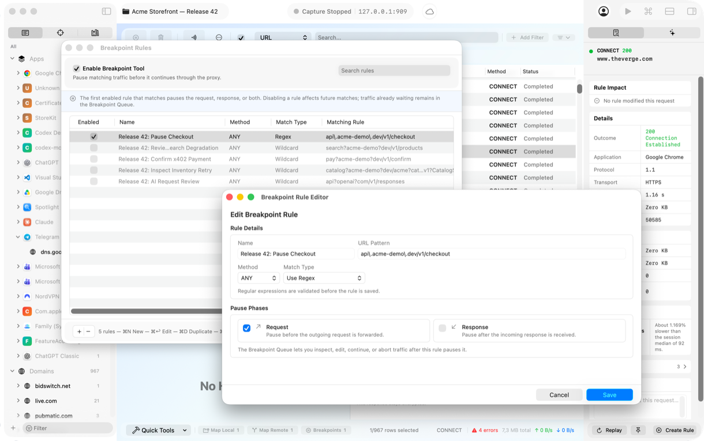

Приостановите запрос или ответ, отредактируйте метод, заголовки, тело или статус, а затем продолжите. Самый быстрый способ проверить: «Что, если API вернет 401?» не касаясь бэкэнда.

`Request Breakpoints` · `Response Breakpoints` · `Block` · `Throttle` · `Regex / Wildcard Match` · `Inject Failure States`

### Изменить заголовки

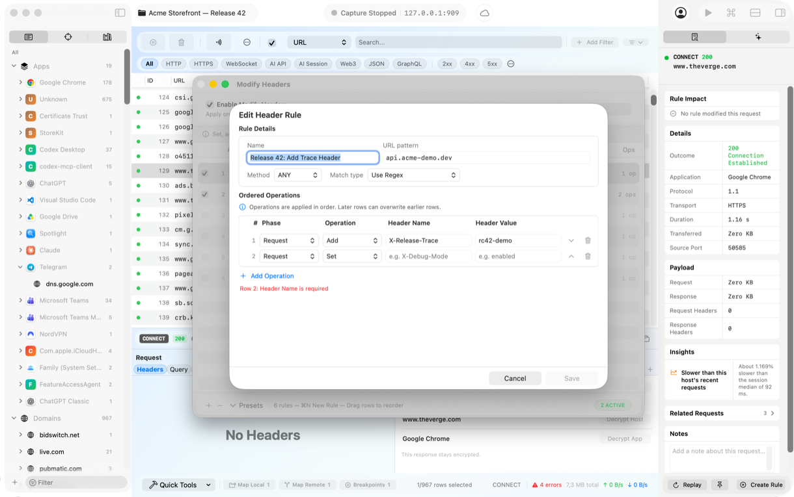

Добавляйте, удаляйте или заменяйте заголовки на любом хосте без повторного развертывания. Тестируйте изменения CORS, аутентификации или кэширования за считанные секунды с помощью встроенных предустановок.

`Add / Remove / Replace` · `CORS Presets` · `Auth Stripping` · `Request Phase` · `Response Phase` · `URL Pattern Scope`

### Пользовательские заголовки запросов и ответов

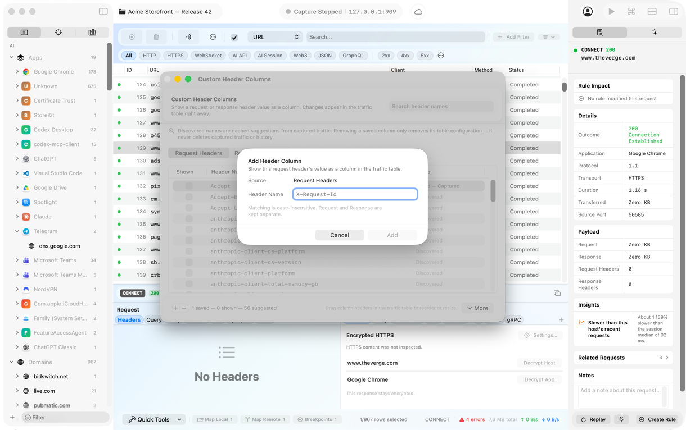

Повысьте любой заголовок запроса или ответа до столбца первого класса в таблице трафика. Держите источники запросов и ответов раздельно, сохраните нужные заголовки, а затем просматривайте request ID, trace ID, состояние кэша или собственные метаданные, не открывая каждый inspector.

`Request Headers` · `Response Headers` · `Saved Columns` · `Trace IDs` · `Case-Insensitive Match` · `Live Table Update`

### Условия сети

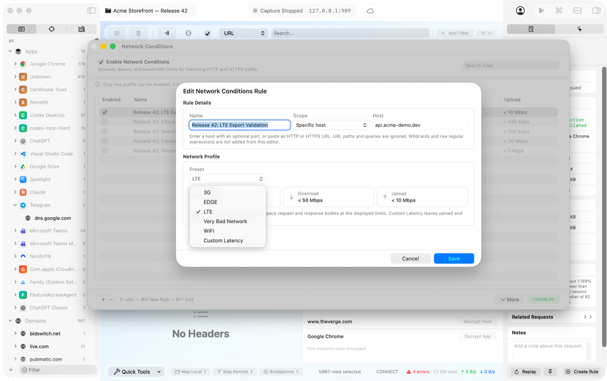

Переключитесь на 3G, EDGE, LTE, Wi-Fi или установите пользовательскую задержку. Ваш ноутбук подключен к оптоволокну; ваши пользователи этого не делают — прежде чем они это сделают, посмотрите UX при RTT 400 мс.

`3G` · `EDGE` · `LTE` · `WiFi` · `Very Bad Network` · `Custom Latency`

### Создание — Редактирование и воспроизведение

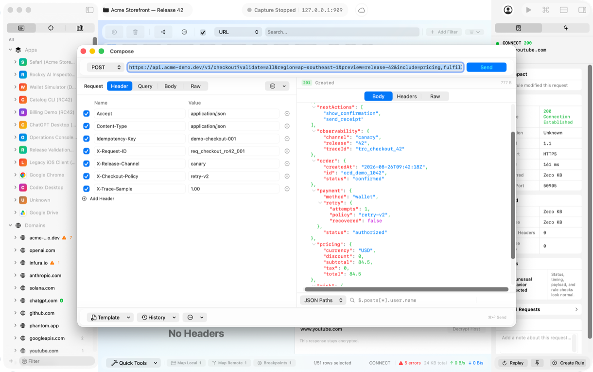

Восстановите любой захваченный HTTP-запрос — измените метод, URL-адрес, заголовки, параметры запроса или тело — и повторите отправку, не покидая Rockxy. Без цикла копирования-вставки в Postman, Insomnia или curl. Выполняйте итерации по запросам LLM, фаззьте границы аутентификации или воспроизводите случай сбоя для конечных точек OpenAI, Anthropic и Cohere за считанные секунды.

`Edit Headers` · `Edit Body` · `Edit Query` · `Edit Method` · `LLM Prompt Iteration` · `Postman Alternative` · `OAuth Flow Debug` · `Webhook Replay`

### Сравнить

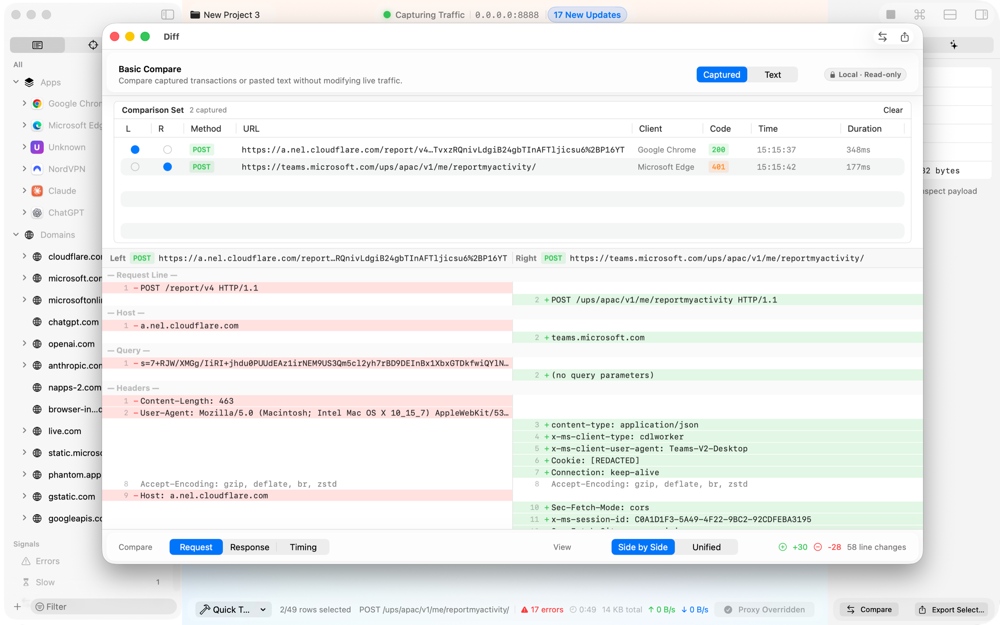

Сложите две захваченные транзакции или вставленные payload рядом и отметьте каждое изменённое поле — статус, заголовки, ключи JSON или байты тела. Улавливайте тихие регрессии API, недетерминированные выходные данные LLM и prompt drift, не передавая ничего в сторонний инструмент сравнения.

`Diff Compare` · `Side-by-Side` · `JSON Diff` · `Header Diff` · `Body Diff` · `LLM Output Compare` · `Non-determinism` · `API Regression` · `Schema Drift`

### Пользовательские вкладки предварительного просмотра

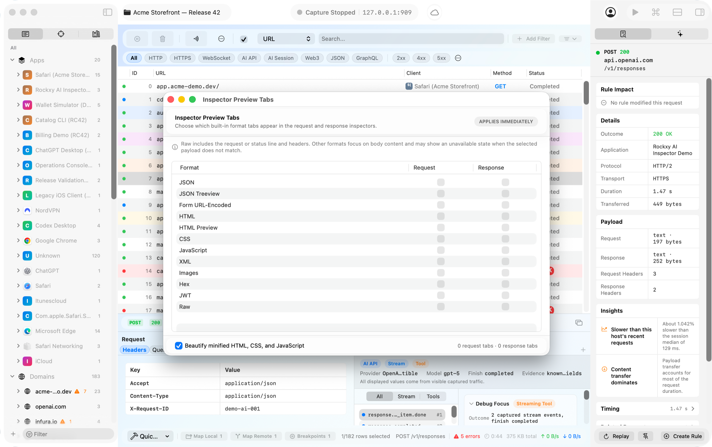

Отрисовывайте тела запросов и ответов так, как вы хотите. Прикрепите к инспектору дополнительные вкладки для JSON, GraphQL, JWT, изображения или вашего собственного формата — их можно будет использовать повторно для каждого перехваченного запроса.

`JSON` · `GraphQL` · `JWT Decoder` · `Image / Hex` · `Custom Format` · `Pinned per Inspector`

### Сессии и экспорт

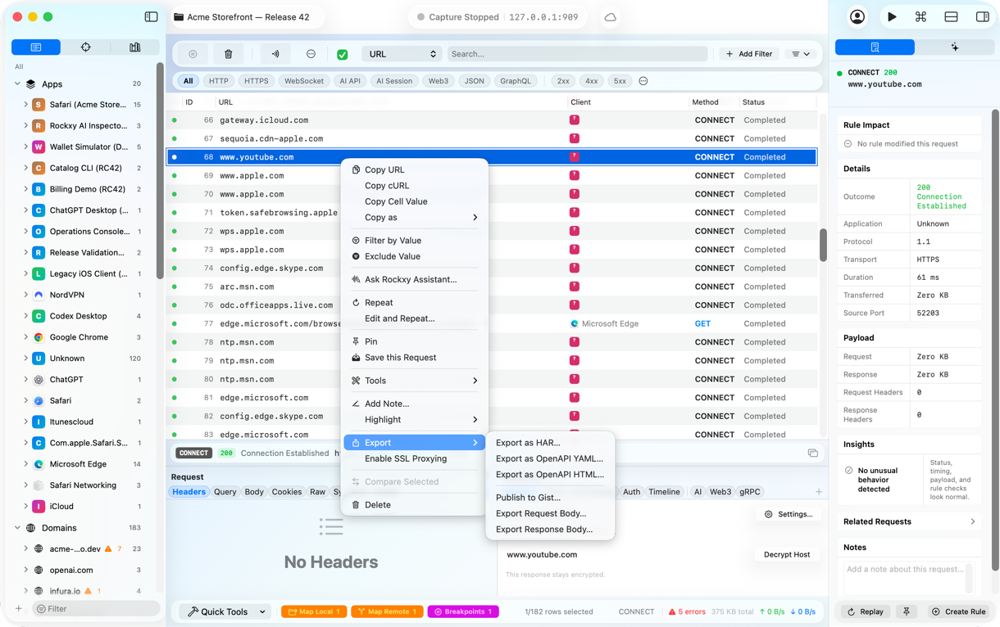

Сохраняйте сеансы, импортируйте/экспортируйте HAR для передачи между инструментами, копируйте любой запрос в формате cURL или JSON. Отредактируйте заголовки авторизации, файлы cookie и токены-носители перед тем, как поделиться ими — дайте товарищу по команде рабочий репродукцию ошибки без утечки секретов.

`.rockxysession` · `HAR Import / Export` · `Copy as cURL` · `Copy as JSON` · `Raw HTTP` · `Secret Redaction` · `Token Sanitize` · `Privacy-Safe Share`

### Рабочие пространства с несколькими вкладками

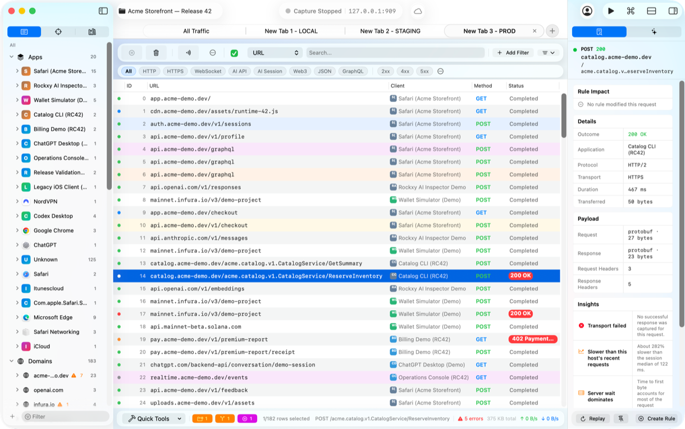

Держите рядом независимые представления расследования одного live capture — одна вкладка для трафика staging, одна для production и одна для потока устройства iOS. Каждая вкладка сохраняет собственные фильтры, сортировку, выбор, scope боковой панели и состояние инспектора, разделяя proxy и захваченные транзакции.

`Shared Live Capture` · `Per-Tab Filters & Sort` · `Per-Tab Inspector` · `Compare Environments` · `Mac & iOS Together` · `Detach & Rename`

### JavaScript-скрипты

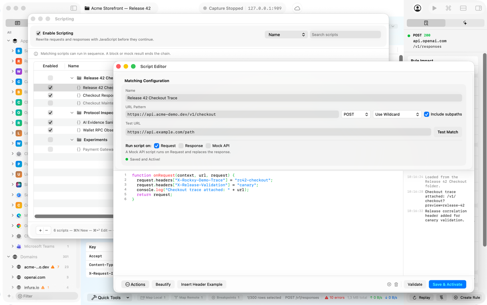

JS перехватывает запросы и ответы в тех случаях, когда статическое правило не может охватить — редактирование личных данных, подписание токенов, перезапись полезных данных. Ошибки появляются внутри, а не портят трафик.

`Request Hooks` · `Response Hooks` · `Programmatic Filtering` · `PII Redaction` · `Inline Error Feedback`

## Инспекция с учетом протокола

Rockxy предоставляет protocol-aware inspection для AI, Web3 RPC и x402 в обычном workflow отладки HTTP.

### Инспекция AI-трафика

Rockxy обнаруживает распознанные запросы AI в рамках обычного workflow захвата. Проверяйте выбранные вызовы моделей, потоковое состояние, поля usage при их наличии, предупреждения, retrieval hints и сводки tool-call, не вставляя конфиденциальные payload в другой сервис.

`AI Requests` · `Model Inspector` · `Streaming State` · `Tool Calls` · `Retrieval Hints` · `Usage Signals`

### Проверка Web3/RPC

Rockxy превращает сетевые вызовы эпохи блокчейна в читаемые доказательства отладки. Проверяйте трафик HTTP JSON-RPC в стиле EVM и Solana с provider host, request ID, method, batch summary, error, chain, transaction, payload и debug-intent, не превращая Rockxy в кошелёк или обозреватель блоков.

`JSON-RPC` · `Solana RPC` · `Request ID` · `RPC Errors` · `Batch Summary` · `Network Evidence`

### Подсказки потока платежей x402

Rockxy выделяет подсказки payment-required и ориентированные на retry, чтобы платёжные HTTP-потоки были понятны с сетевого уровня, при этом доказательства отладки остаются локальными и redaction-aware.

`Payment Required` · `Retry Flow` · `Headers` · `Redaction` · `Local First`

## Будущая Работа

Следующие разделы описывают публичное направление, а не текущее поведение.

### Правила с учетом протоколов

Rockxy уже сегодня может маркировать и проверять трафик AI и Web3. Более глубокое сопоставление правил по model, tool call, методу JSON-RPC, chain, transaction hash или batch subcall остаётся будущей работой; текущие инструменты изменения трафика по-прежнему сопоставляют URL, HTTP-метод и заголовки.

`Smart Filters` · `Request Badges` · `Protocol Column` · `Inspector Tabs` · `Future Rule Metadata`

### Пакеты отредактированных доказательств `Скоро`

Поделитесь фактами, необходимыми для воспроизведения ошибки, не разглашая секретов. Упакуйте выбранный трафик со сводками протоколов, предварительным просмотром изменений и контекстом на основе источника, который партнер по команде может проверить.

`Debug Bundles` · `Protocol Summary` · `Export Preview` · `Secret Redaction` · `Repro Context`

### Совместное использование команды и сотрудничество `Скоро`

Отправьте записанную сессию товарищу по команде одним щелчком мыши. Аннотируйте неудачные запросы в режиме реального времени, узнавайте, кто что смотрит, и выполняйте парную отладку HTTPS-трафика без совместного использования экрана. Предназначен для будущего выпуска.

`Shared Sessions` · `Team Workspaces` · `Inline Comments` · `Live Cursor` · `Cloud Sync` · `Pair Debug` · `SSO` · `Audit Log`

> Нативная оболочка приложения macOS — без Electron. SwiftUI + AppKit + SwiftNIO, WebKit используется только для предпросмотра тела HTML.

## Быстрый старт

```bash
git clone https://github.com/RockxyApp/Rockxy.git
cd Rockxy
open Rockxy.xcodeproj
```

Соберите и запустите в Xcode. Окно приветствия поможет вам выполнить настройку корневого центра сертификации, установку помощника и активацию прокси-сервера.

**Требования:** macOS 14.0+, Xcode 16+, Swift 5.9

Если вы хотите подключить Rockxy к локальному клиенту MCP после установки, см. [Руководство по интеграции MCP](docs/features/mcp.mdx).

## Rockxy против альтернатив

|    | **Rockxy** | **Proxyman** | **Charles Proxy** |
|---|---|---|---|
| **Модель проекта** | Проект с открытым исходным кодом AGPL-3.0 | Собственное коммерческое приложение | Собственное коммерческое приложение |
| **Исходный код** | Публичный, проверяемый, форкируемый | Закрытый исходный код | Закрытый исходный код |
| **Сборка из исходного кода** | Бесплатно с Xcode из этого репозитория | Недоступно из открытого источника | Недоступно из открытого источника |
| **Собственная основа macOS** | Swift + SwiftNIO + SwiftUI/AppKit | Нативное приложение macOS с закрытым исходным кодом | Кроссплатформенное приложение с закрытым исходным кодом |
| **Локальный захват** | Локальный прокси, сертификаты, помощник и данные захвата остаются на вашем Mac | Прокси-приложение для ПК | Прокси-приложение для ПК |
| **Рабочий процесс настройки разработчика** | Встроенный центр настройки разработчиков для сред выполнения, клиентов, устройств, платформ и сред | Встроенная автоматическая настройка плюс руководства по платформам и средам выполнения | Руководства по настройке для конкретной платформы |
| **Внешний прокси + PAC-маршрутизация** | Восходящий прокси-сервер HTTP/HTTPS, автоматическая настройка PAC и правила обхода | Коммерческий восходящий прокси и поддержка PAC | Коммерческая настройка восходящего прокси |
| **Интеграция MCP** | [Встроенный локальный MCP](docs/features/mcp.mdx): 10 инструментов только для чтения для трафика, статуса, сертификатов, проверки правил и экспорта cURL; аутентификация по токену; redaction включён по умолчанию | Встроенный локальный MCP: проверка трафика плюс инструменты правил, сессий, сертификатов, настройки и управления приложением; только localhost; аутентификация по токену для каждой сессии; redaction конфиденциальных данных | Первичная интеграция MCP не найдена в [официальной документации](https://www.charlesproxy.com/documentation/), проверенной 2026-08-13 |
| **Нативный AI Assistant** | Встроен для анализа трафика по выбранному запросу и нескольким запросам внутри Rockxy | Неизвестно | Неизвестно |
| **Открытый путь вклада** | Публичный исходный код, issues, обсуждения, дорожная карта и PR | Публичный трекер issue; исходный код приложения и релизы контролируются поставщиком | Документация и поддержка поставщика; исходный код приложения и релизы контролируются поставщиком |

Приведённые выше возможности конкурентов были проверены по официальной документации продукта 2026-08-13 и могут измениться после публикации.

В планах: более глубокие protocol-aware rules, безопасные redacted evidence bundles, усиленные workflow воспроизведения и сравнения, более широкие руководства Developer Setup и продолжающееся исследование HTTP/2 и HTTP/3.

## Безопасность

Rockxy перехватывает сетевой трафик — безопасность является основополагающей, а не дополнительной.

- Помощник XPC проверяет вызывающих абонентов через **сравнение цепочки сертификатов**, а не только идентификатор пакета
- Плагины запускаются **JavaScriptCore в песочнице** с 5-секундным таймаутом, без доступа к файловой системе/сети
- **Проверка ввода** на всех границах — ограничения размера тела, ограничения URI, защита от DoS регулярных выражений, предотвращение обхода пути.
- Полномочия **автоматически редактируется** в захваченных журналах
- Конфиденциальные файлы, хранящиеся с **0o600 разрешения**

Сообщайте об уязвимостях через [SECURITY.md](SECURITY.md). См. [полная архитектура безопасности](docs/development/security.mdx) для получения подробной информации.

## Дорожная карта

Публичная дорожная карта Rockxy ориентирована на рабочий процесс и не требует дат. Основное внимание уделяется надежности, встроенному пользовательскому интерфейсу macOS, рабочим процессам отладки, поддержке протоколов, видимости трафика эпохи AI/Web3, документации и адаптации участников.

- [ROADMAP.md](ROADMAP.md): высшее государственное инженерное направление
- [Общественная дорожная карта Rockxy](https://github.com/orgs/RockxyApp/projects/1): оперативная видимость проблем, отслеживаемых в дорожной карте.

## Документация

Полная документация доступна на сайте [Роккси Документы](docs/index.mdx):

- [Краткое руководство](docs/quickstart.mdx) — приступить к работе за считанные минуты
- [Центр настройки для разработчиков](docs/features/developer-setup-hub.mdx) — фрагменты времени выполнения, руководства по устройствам, тесты проверки и матрица поддержки.
- [AI Assistant](docs/features/ai-assistant.mdx) — исследуйте выбранный трафик локально или с настроенной моделью после Review Data
- [Фильтры и поиск](docs/core-features/filters-and-search.mdx) — scope боковой панели, Focus Sets, Noise Control, фильтры toolbar и поиск
- [Инспекция AI и Web3](docs/features/ai-web3-inspection.mdx) — проверяйте распознанный трафик model API, JSON-RPC и x402
- [Интеграция MCP](docs/features/mcp.mdx) — подключить Rockxy к локальным клиентам MCP
- [Архитектура](docs/development/architecture.mdx) — прокси-движок, модель актера, поток данных
- [Модель безопасности](docs/development/security.mdx) — границы доверия, проверка XPC, управление сертификатами
- [Дизайнерские решения](docs/development/design-decisions.mdx) — почему SwiftNIO, NSTableView, актеры
- [Сборка из исходного кода](docs/development/building.mdx) — сборка, тестирование, анализ и отладка
- [Стиль кода](docs/development/code-style.mdx) — SwiftLint, SwiftFormat и соглашения
- [Журнал изменений](CHANGELOG.md) — неизданные работы и отмеченные релизы

## Содействие

Вклад приветствуется — код, тесты, документация, отчеты об ошибках и отзывы о UX.

См. **[CONTRIBUTING.md](CONTRIBUTING.md)** инструкции по настройке, стиль кода и полный контрольный список PR.

Хорошие первые проблемы помечены [`good first issue`](https://github.com/RockxyApp/Rockxy/labels/good%20first%20issue). Открывая PR, вы соглашаетесь с [CLA](CLA.md).

## Спонсоры и партнеры

Rockxy поддерживается независимо. Спонсорство помогает финансировать непрерывную разработку, инфраструктуру релизов, документацию и работу над безопасностью.

<p align="center">
  <a href="https://opencollective.com/rockxy/donate">
    
  </a>
  <a href="https://github.com/sponsors/LocNguyenHuu">
    
  </a>
</p>

Rockxy получает фискальное сопровождение от [Open Source Collective](https://docs.oscollective.org/). Взносы и расходы проекта публикуются на [открытой странице Rockxy в Open Collective](https://opencollective.com/rockxy), обеспечивая прозрачность получения и использования средств.

| Уровень | Взнос | Что поддерживает |
|---------|-------|------------------|
| **Backer** | От $5/месяц | Поддержку открытого исходного кода, документацию, тестирование и релизы |
| **Builder** | От $25/месяц | Регрессионное тестирование, повышение производительности и ежедневные процессы отладки |
| **Sponsor** | $100/месяц | Долгосрочную поддержку ориентированного на конфиденциальность инструмента, бесплатного для разработчиков |
| **Sustaining Sponsor** | $500/месяц | Целенаправленную поддержку и развитие продукта, включая автоматизацию релизов и поддержку протоколов |

**Запросы о партнерстве** — компании-разработчики инструментов, охранные фирмы и корпоративные команды, которым нужны индивидуальные интеграции или решения «white label»: [rockxyapp@gmail.com](mailto:rockxyapp@gmail.com)

## Поддержка

- [Open Collective](https://opencollective.com/rockxy/donate) — поддержать Rockxy через прозрачный бюджет проекта
- [GitHub Sponsors](https://github.com/sponsors/LocNguyenHuu) — поддержать развитие Rockxy
- [Проблемы с GitHub](https://github.com/RockxyApp/Rockxy/issues) — отчеты об ошибках и запросы функций
- [Обсуждения на GitHub](https://github.com/RockxyApp/Rockxy/discussions) — вопросы и чат сообщества
- **электронная почта** — [rockxyapp@gmail.com](mailto:rockxyapp@gmail.com)
- **Проблемы безопасности** - см. [SECURITY.md](SECURITY.md) за ответственное раскрытие информации

## Лицензия

[Стандартная общественная лицензия GNU Affero v3.0](LICENSE) — Авторские права Rockxy Contributors, 2024–2026 гг.

## Звездная история

<a href="https://star-history.dera.page/#RockxyApp/Rockxy&type=date&legend=top-left">
 <picture>
   <source media="(prefers-color-scheme: dark)" srcset="https://star-history.dera.page/svg?repos=RockxyApp/Rockxy&type=date&theme=dark&legend=top-left" />
   <source media="(prefers-color-scheme: light)" srcset="https://star-history.dera.page/svg?repos=RockxyApp/Rockxy&type=date&legend=top-left" />
   
 </picture>
</a>

---

<p align="center">
  <sub>Сделано <a href="https://github.com/LocNguyenHuu">Stephen</a>. Создано с использованием Swift, SwiftNIO, SwiftUI и AppKit.</sub>
</p>
